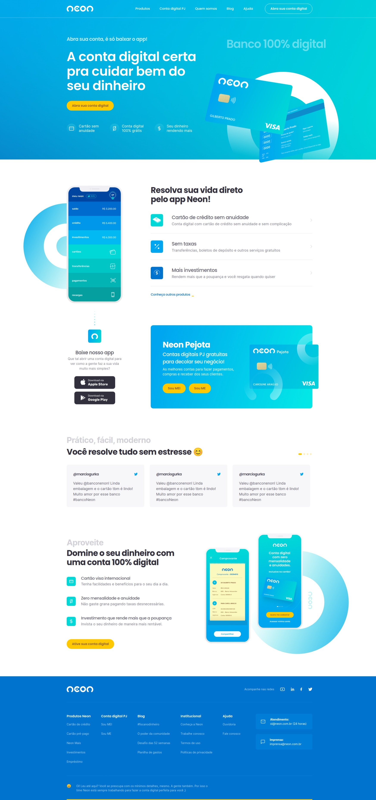

# 🚀 Projeto de Redesign da Página do Banco Neon!

Este projeto consiste em uma lading page repaginada para a página do Banco Neon. Durante o desenvolvimento, adquiri conhecimentos valiosos sobre a estruturação de HTML, estilização de CSS e a utilização do pré-processador Sass. Além disso, o projeto é totalmente responsivo e explorei bastante o uso do Flexbox. Aqui estão alguns dos destaques:

## 📚 Aprendizados do Projeto:
- Estruturação HTML: Utilizei tags semânticas para criar uma estrutura organizada e acessível.
- Estilização CSS e Sass: Apliquei estilos personalizados, aproveitando os recursos avançados do Sass para aumentar a produtividade.
- Responsividade: Garanti que a página se adaptasse perfeitamente a diferentes dispositivos e tamanhos de tela. 📱💻
- Flexbox: Aprofundei meus conhecimentos no CSS Flexbox para criar layouts flexíveis e alinhados.
- Animações: Incorporei animações usando a biblioteca AOS para adicionar efeitos especiais e tornar a página mais interativa. ✨🎉
- Slider Dinâmico: Utilizei a biblioteca Swiper para criar slides dinâmicos e interativos. 

## 🌐 Veja o Projeto ao Vivo!
Confira o projeto de redesign da página do Banco Neon através deste [link](https://loriprojects-neon.netlify.app/). Ficarei feliz em receber seu feedback!

## 🎉 Contribuições
Contribuições, sugestões e melhorias são sempre bem-vindas!.

Divirta-se explorando o projeto e aproveite as funcionalidades! Se tiver alguma dúvida, estou à disposição.

